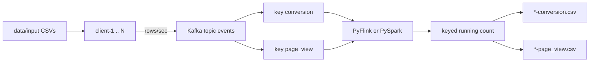

# Streaming Pipeline Example

CSV clients produce rows at a configurable rate. A server consumes the same Kafka topic with **Apache Flink** or **Apache Spark**. Kafka is ingest only. Apply one processor, not both.



The Kafka key comes from the CSV `is_conversion` column (`conversion` vs `page_view`). The topic has **2 partitions** so Flink `keyBy` / Spark `groupBy` stay aligned with the broker.

## Layout

```
client/              CSV producer (Docker image)
server/flink/        PyFlink job (Docker image)
server/spark/        PySpark job (Docker image)
utils/common/        Shared CSV + affinity helpers
data/input/          CSVs the clients read
data/output/         Files the server writes (local bind-mount)
scripts/             generate-compose
k8s/                 Kubernetes manifests (kubectl / kustomize)
terraform/           EKS, AKS, GKE + shared workload module
```

Images are built from the **repo root** so Dockerfiles can `COPY utils`.

## Local (two terminals)

```bash
make generate-compose
```

Prompts: client count, rows/sec, per-client CSV under `data/input/`, Flink vs Spark. Writes gitignored `docker-compose.generated.yml`.

**Terminal 1**

```bash
make server
```

**Terminal 2**

```bash
make client
```

```bash
make client-logs CLIENT_ID=client-1
make server-logs
make down
```

`make server` / `make client` fail if the generated Compose file is missing.

## Cloud

Same images as local. Terraform creates a small Kubernetes cluster, a container registry, then applies the workload (Kafka, topic init, one processor, one Deployment per client). **Apply Flink or Spark, not both** (`PIPELINE=flink` or `PIPELINE=spark`).

Clusters cost money; destroy when you are done.

### 1. tfvars

Copy the example for the cloud you want and fill in required values (`subscription_id` on Azure, `project_id` on GCP):

```bash
cp terraform/azure/terraform.tfvars.example terraform/azure/terraform.tfvars
```

`terraform.tfvars` is gitignored. `rows_per_second` and `clients` stay in that file; `PIPELINE` and `IMAGE_TAG` are Makefile variables passed into Terraform.

### 2. Deploy

Logged in with `aws` / `az` / `gcloud` (and `gcloud auth application-default login` for GCP):

```bash
make deploy-aws
make deploy-azure
make deploy-gcp
```

Spark instead of Flink:

```bash
make deploy-azure PIPELINE=spark
```

Each target: `terraform init` → cluster + registry → build images → push → apply the workload. Prints the kubeconfig command at the end.

```bash
kubectl -n streaming get pods
kubectl -n streaming logs -f deploy/processor
kubectl -n streaming logs -f deploy/client-1
kubectl -n streaming exec deploy/processor -- ls /data/output
```

If pods started before the push finished:

```bash
kubectl -n streaming rollout restart deploy
```

### 3. Tear down

```bash
make destroy-aws
make destroy-azure
make destroy-gcp
```

Use the same `PIPELINE=` / `IMAGE_TAG=` you deployed with.

### Optional: kubectl / kustomize without Terraform workload

After you have a cluster and have pushed images, you can apply [`k8s/`](k8s/) yourself. Default kustomization uses Flink:

```bash
cd k8s
kustomize edit set image IMAGE_PROCESSOR=REGISTRY/streaming-flink:latest IMAGE_CLIENT=REGISTRY/streaming-client:latest
kubectl apply -k .
```

For Spark, change `kustomization.yaml` to `processor-spark.yaml` and `streaming-spark`.

## Variables

| Variable | Meaning |
| --- | --- |
| `PIPELINE` | Makefile / Terraform: `flink` or `spark` (default `flink`) |
| `IMAGE_TAG` | Tag built and pushed (default `latest`) |
| `rows_per_second` | Rate applied to every client (`terraform.tfvars`) |
| `clients` | List of `{ id, csv }` — CSV names must exist under `data/input/` |
